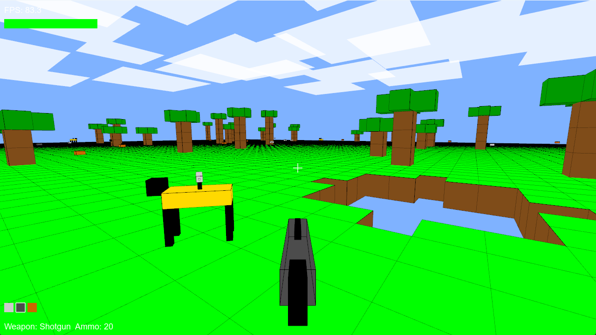

# MineFPS

MineFPS is a first-person shooter demo set within a procedurally generated, voxel-like world in the style of Minecraft.  It is written entirely by OpenAI’s o1-pro model using iterative prompting.  It leverages [PyOpenGL](https://www.google.com/search?q=PyOpenGL) and [Pygame](https://www.google.com/search?q=pygame) for rendering and input, and features dynamic chunk loading, basic enemies, projectiles, explosions, and world deformation.

## Features

1. **Voxel-Style World Generation:**  
   The environment is chunk-based, similar to Minecraft. Blocks are generated on-the-fly, and chunks load and unload as the player moves.
   
2. **Procedural Terrain and Obstacles:**  
   Each chunk introduces a varying pattern of blocks, occasional obstacles like leaf blocks, and items.

3. **Player Movement and Physics:**  
   The player can move, jump, and interact with the world under gravity and collision constraints. The code handles basic collision detection and gravity simulation.

4. **Weaponry and Projectiles:**  
   The player starts with three weapons:  
   - Pistol (high ammo, moderate damage)  
   - Shotgun (spread of multiple pellets per shot)  
   - Rocket Launcher (explosive projectiles that deform the world)  
   
   Ammo pickups are scattered around the world.

5. **Hostile Enemies (Robodogs):**  
   Enemies patrol chunks, occasionally firing at the player. They respond to hits and explosions, and have their own simple AI logic for movement and targeting.

6. **Explosions and World Deformation:**  
   Rockets cause explosions that remove blocks and leave bullet marks on impacted surfaces. The world updates rendering dynamically after block removal.

7. **Bullet Marks and Visual Effects:**  
   Shots leave bullet marks on surfaces, and rocket blasts produce sparks and fireballs rendered as particle systems.

## Running the game

```python main.py```

## Coding the game

If you run unify.py you will get a single text file with all source code for the game organized by tags that you can paste into an AI model's context window like o1-pro to continue development.  This method was used to iteratively develop the game.

## Controls
   - W / A / S / D: Move forward/left/back/right.
   - Mouse Movement: Look around (pitch and yaw).
   - Left Mouse Button: Fire the currently selected weapon.
   - Space: Jump.
   - Shift (hold): Sprint for increased movement speed.
   - 1 / 2 / 3: Switch between the Pistol, Shotgun, and Rocket Launcher.
   - Mouse Wheel: Quick-swap through available weapons.
   - Escape: Quit the game.
   - F11: Toggle fullscreen.

## Weapons and Ammo
   - Pistol: Medium rate of fire, decent accuracy, large ammo pool.
   - Shotgun: Fires multiple pellets with wide spread; good for close range.
   - Rocket Launcher: Slow fire rate, limited ammo, but destructive explosions that deform the world.
   - Ammo pickups appear around the world and can be collected by moving close to them.

## Screenshot
